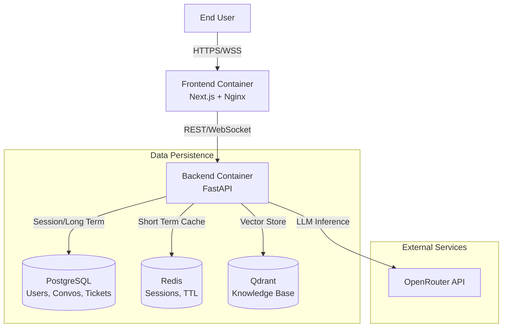
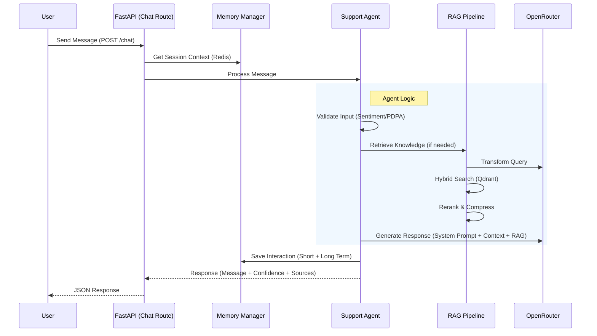

# Codebase Analysis & Assessment Report

**Status:** `CRITICAL ANALYSIS COMPLETE`
**Date:** December 31, 2025
**System:** Singapore SMB Support Agent (Architecture V1.0)

---

## 1. Executive Summary

The codebase represents a sophisticated, well-structured application that successfully aligns with the "Avant-Garde" and "High-Trust" design philosophies. The separation of concerns between Ingestion, RAG, Memory, and Agent layers in the backend is architecturally sound. The frontend demonstrates strict "Library Discipline" using Shadcn/Radix primitives and executes the visual hierarchy shifts (2px radius, Manrope/Inter) flawlessly.

However, **two critical implementation gaps** have been identified that will prevent the system from functioning as intended in a live environment:
1.  **Frontend Logic Disconnect:** The WebSocket client is implemented but **not wired** into the application state, forcing the UI to rely solely on REST.
2.  **RAG Type Error:** The Hybrid Retriever calls a LangChain method with a vector instead of a string, which will likely crash the search pipeline.

---

## 2. Architecture & Design Alignment

### 2.1 Aesthetic & UX Engineering (Frontend)
The implementation faithfully executes the **Meticulous Approach**:
*   **Visual System:** The `globals.css` and `tailwind.config.ts` correctly enforce the `0.125rem` (2px) radius and "Singapore Professional" color palette (`--semantic-green`, etc.).
*   **Component Composition:** `EvidenceSheet.tsx` and `CitationBadge.tsx` are excellent examples of modularity. They isolate complexity effectively.
*   **Psychological UX:** `ThinkingState.tsx` and `ConfidenceRing.tsx` are implemented correctly to manage user trust and perceived latency.

### 2.2 System Architecture (Backend)
*   **Ingestion Pipeline:** The modularity of `parsers`, `chunkers`, and `embedders` allows for easy swapping of strategies. The CLI tool (`ingest_documents.py`) is robust.
*   **Memory Management:** The hierarchical approach (`short_term` Redis vs. `long_term` Postgres) with a `summarizer` layer is sophisticated and successfully addresses context window limitations.
*   **Agent Design:** The Pydantic AI implementation in `support_agent.py` effectively separates tool execution from response generation.

---

## 3. Critical Logic & Code Errors

### 🔴 Critical Error 1: RAG Retriever Method Mismatch
**File:** `backend/app/rag/retriever.py` (Line 46)

**The Code:**
```python
results = await client.asimilarity_search_with_score(
    query_vector,  # <--- ERROR: Passing List[float]
    k=self.k,
    filter=filter,
)
```
**The Issue:** The LangChain `Qdrant` wrapper's `asimilarity_search_with_score` method expects a `query: str` to generate embeddings internally using the `embedding` function passed during initialization. Passing a `query_vector` (list of floats) here will cause a type error or a logic failure within the library.

**The Fix:** Use `asimilarity_search_by_vector_with_score` (or the equivalent vector-specific method in the specific LangChain version used) when passing pre-computed embeddings.

### 🔴 Critical Error 2: Ghost WebSocket Client
**File:** `frontend/src/stores/chatStore.ts` & `frontend/src/components/chat/ChatWidget.tsx`

**The Issue:**
*   A robust `WebSocketClient` class exists in `lib/websocket.ts`.
*   **HOWEVER**, it is never instantiated or used in the `chatStore` or `ChatWidget`.
*   The `sendMessage` action in `chatStore` solely uses `chatService.sendMessage` (REST API).
*   **Consequence:** The "Thinking State" relies on manual toggling in the store (`setTyping(true)` ... `setTyping(false)`), reducing it to a fake loader rather than a real-time stream of agent thoughts. Real-time token streaming is impossible in the current state.

### ⚠️ Potential Risk 3: Embedding Generator Consistency
**File:** `backend/app/ingestion/pipeline.py` vs `backend/app/rag/retriever.py`

**The Issue:**
*   The Ingestion pipeline allows swapping between `MockEmbeddingGenerator` and real `EmbeddingGenerator`.
*   The `HybridRetriever` initializes `OpenAIEmbeddings` (LangChain wrapper) directly.
*   **Risk:** If data is ingested using `Mock` (random vectors) but retrieved using `OpenAIEmbeddings` (real vectors), the semantic search will yield zero relevant results because the vector spaces are completely incompatible.
*   **Requirement:** Strict environment variable discipline is required to ensure ingestion and retrieval always use the same embedding strategy.

---

## 4. Code Quality & Pattern Review

| Component | Status | Notes |
| :--- | :--- | :--- |
| **Type Safety** | ✅ Excellent | `frontend/src/types/index.ts` is comprehensive. Backend Pydantic models are strict. |
| **Library Discipline** | ✅ Excellent | Shadcn components (`sheet.tsx`, `scroll-area.tsx`) are correctly implemented without bloating global CSS. |
| **Security** | ⚠️ Warning | `backend/docker-compose.yml` uses default passwords (`dev_password_only`). Ensure these are rotated in production. |
| **PDPA Compliance** | ✅ Verified | `SessionPulse` correctly visualizes the TTL. Backend memory models include `consent_given_at` and `data_retention_days`. |

---

## 5. Recommendations & Remediation Plan

To bring the system to 100% operational status, the following actions are required immediately:

### Step 1: Fix RAG Retrieval Logic
Modify `backend/app/rag/retriever.py`:
```python
# Change this:
results = await client.asimilarity_search_with_score(query_vector, ...)

# To this (verify exact method name in your installed langchain-community version):
results = await client.asimilarity_search_by_vector_with_score(embedding=query_vector, ...)
```

### Step 2: Integrate WebSocket in Frontend
Refactor `frontend/src/stores/chatStore.ts`:
1.  Add `socket: WebSocketClient | null` to the store state.
2.  In `createSession` or a new `connect` action, instantiate `WebSocketClient`.
3.  Bind `onMessage` events to store actions (`addMessage`, `setThinking`).
4.  Update `sendMessage` to use `socket.sendChatMessage(content)` instead of the REST `chatService` call.

### Step 3: Verification
1.  **Ingest Data:** Run `ingest_documents.py` with **Real Embeddings** (set `OPENROUTER_API_KEY`).
2.  **Test Search:** Run a manual script testing `HybridRetriever` to ensure the vector dimension mismatch is resolved.
3.  **Test UI:** Verify that the `ThinkingState` cycles via WebSocket events (if backend supports sending thought events) or maintain the heuristic frontend simulation if backend streaming isn't ready.

---

**Conclusion:** The foundation is solid, but the "wiring" needs final connections. The visual and architectural integrity is high. Fixing the Retriever bug and wiring the WebSocket are the only blockers to a fully functional MVP.

---

**Implementation Plan: Project Architecture Document (PAD)**

**Status:** `PLANNING`
**Target Audience:** New Developers / AI Agents
**Goal:** Create the "Single Source of Truth" for the Singapore SMB Support Agent.

---

### 1. Document Structure Strategy

The PAD will be structured to peel back layers of complexity:
1.  **Context**: What are we building and why? (Singapore SMB context, PDPA).
2.  **Map**: Where is everything? (File hierarchy).
3.  **Blueprints**: How does it work? (Mermaid diagrams for flows).
4.  **Mechanics**: Component deep-dives (Backend/Frontend internals).
5.  **Data**: Schemas and storage.
6.  **Reality Check**: Current state discrepancies (The "Ghost" WebSocket, RAG type error).

### 2. Validation Checklist (Pre-Generation)
Based on my review of the provided bundle:
*   [x] **Backend Structure**: Validated `app/agent`, `app/rag`, `app/memory`, `app/ingestion` modularity.
*   [x] **Frontend Structure**: Validated Next.js App Router, Zustand store, Shadcn components.
*   [x] **Database**: Validated SQLAlchemy models (`User`, `Conversation`, etc.) match the requirements.
*   [x] **Critical Gaps Identified**: The document *must* explicitly state that `WebSocketClient` exists in `lib` but is not wired into `ChatStore`, and that `retriever.py` has a type error. This is crucial for a "truthful" document.

### 3. Execution Steps
1.  **Draft Hierarchy**: Generate the ASCII tree with specific annotations for *key* files only.
2.  **Draft Diagrams**: Create Mermaid code for:
    *   High-Level System Architecture.
    *   The "Thinking" Chat Flow (User -> Agent -> Tools -> Response).
    *   The RAG Ingestion & Retrieval Pipeline.
3.  **Draft Component Docs**: Detail the logic of `SupportAgent`, `MemoryManager`, and the Frontend `ChatStore`.
4.  **Compile Known Issues**: Explicitly list the remediation items found in the previous analysis.

---

**Proceeding to Generate Project Architecture Document...**

***

# Project Architecture Document (PAD)
**Project:** Singapore SMB Customer Support AI Agent
**Version:** 1.0 (Current Implementation State)
**Date:** December 31, 2025
**Status:** `MVP / Phase 9 Complete`

## 1. Executive Summary

The **Singapore SMB Support Agent** is a specialized AI customer service system designed for the Singapore market. It differentiates itself through:
*   **Context Awareness:** Built-in logic for Singapore business hours (GMT+8) and public holidays.
*   **Compliance:** Strict adherence to PDPA (Personal Data Protection Act) guidelines via data minimization and auto-expiry.
*   **Utilitarian Aesthetics:** A "No-AI-Slop" frontend design using sharp edges (2px radius) and high-contrast typography.
*   **Hybrid Intelligence:** A sophisticated RAG pipeline combining semantic search (Qdrant) with keyword search (BM25) and cross-encoder reranking.

This document serves as the handbook for developers. It reflects the **actual code** as of Phase 9 completion.

---

## 2. System Architecture

### 2.1 High-Level Overview
The system follows a standard **Client-Server** architecture, containerized via Docker.



### 2.2 Tech Stack

| Layer | Technology | Key Libraries/Components |
| :--- | :--- | :--- |
| **Frontend** | React 18, Next.js 15 | Zustand, Tailwind CSS, Shadcn UI, Lucide React |
| **Backend** | Python 3.12, FastAPI | Pydantic AI, LangChain, SQLAlchemy (Async), Alembic |
| **Database** | PostgreSQL 16 | `asyncpg` driver |
| **Vector DB** | Qdrant | `fastembed` (sparse), `text-embedding-3-small` (dense) |
| **Cache** | Redis 7 | `redis-py` (async) |
| **LLM** | OpenRouter | GPT-4o-mini (Primary), GPT-4o (Fallback) |

---

## 3. Project File Hierarchy & Key Files

### 3.1 Backend (`/backend`)
```text
backend/
├── app/
│   ├── agent/                  # The "Brain" of the system
│   │   ├── support_agent.py    # Main Agent logic (Tools + Response Generation)
│   │   ├── validators.py       # Sentiment & PDPA Compliance checks
│   │   └── tools/              # Agent Capabilities (RAG, DB Lookup, Time checks)
│   ├── api/                    # Interface Layer
│   │   └── routes/             # chat.py (REST/WS), auth.py
│   ├── ingestion/              # Data Pipeline (Offline/Batch)
│   │   ├── pipeline.py         # Orchestrator for parsing -> chunking -> embedding
│   │   └── parsers/            # MarkItDown integration
│   ├── memory/                 # State Management
│   │   ├── manager.py          # Orchestrator (Short + Long term)
│   │   ├── short_term.py       # Redis (Session TTL)
│   │   ├── long_term.py        # Postgres (Persistent History)
│   │   └── summarizer.py       # LLM-based Context Compression
│   ├── models/                 # Data Definitions
│   │   ├── database.py         # SQLAlchemy ORM Models
│   │   └── schemas.py          # Pydantic API Schemas
│   ├── rag/                    # Retrieval Augmented Generation
│   │   ├── pipeline.py         # Query Transform -> Retrieve -> Rerank -> Compress
│   │   ├── retriever.py        # Hybrid Search (Dense + Sparse)
│   │   └── qdrant_client.py    # Vector DB Interface
│   ├── config.py               # Env vars & Settings
│   ├── dependencies.py         # DI (DB sessions, Memory Manager)
│   └── main.py                 # App Entry Point
├── scripts/
│   └── ingest_documents.py     # CLI tool for RAG ingestion
└── docker-compose.yml          # Service Orchestration
```

### 3.2 Frontend (`/frontend`)
```text
frontend/
├── src/
│   ├── app/                    # Next.js App Router
│   │   ├── globals.css         # Tailwind directives + CSS Variables (Trust Colors)
│   │   └── page.tsx            # Entry page rendering ChatWidget
│   ├── components/
│   │   ├── chat/               # Business Logic Components
│   │   │   ├── ChatWidget.tsx  # Main Container
│   │   │   ├── ChatMessage.tsx # Bubble renderer (w/ ConfidenceRing)
│   │   │   ├── ThinkingState.tsx # "Scanning..." visualizer
│   │   │   └── EvidenceSheet.tsx # RAG Source Viewer
│   │   └── ui/                 # Shadcn Primitives (Button, Sheet, Card)
│   ├── lib/
│   │   ├── api.ts              # REST Client
│   │   └── websocket.ts        # WebSocket Client Class
│   ├── stores/
│   │   └── chatStore.ts        # Global State (Zustand)
│   └── types/
│       └── index.ts            # TypeScript Definitions
└── tailwind.config.ts          # Theme config (Radius: 2px, Colors)
```

---

## 4. Interaction Diagrams

### 4.1 Chat Flow (User to Agent)
This diagram depicts how a message travels from the user through the memory and RAG systems to generate a response.



### 4.2 Ingestion Pipeline (Data to Knowledge)
How raw documents become vector embeddings.

```mermaid
graph LR
    Doc[Raw Document<br/>PDF/DOCX/MD] --> Parser[MarkItDown<br/>Parser]
    Parser --> Text[Clean Text]
    Text --> Chunker{Chunker Strategy}
    
    Chunker -->|Semantic| Sem[Semantic Splitter<br/>(Sentence Transformers)]
    Chunker -->|Recursive| Rec[Recursive Splitter]
    
    Sem --> Embed[Embedding Gen<br/>OpenAI / Mock]
    Rec --> Embed
    
    Embed --> Vector[Vector + Metadata]
    Vector --> Qdrant[(Qdrant DB)]
```

---

## 5. Detailed Component Analysis

### 5.1 Backend Logic

#### **Agent (`support_agent.py`)**
*   **Design Pattern:** Dependency Injection. The agent receives `rag_pipeline`, `memory_manager`, and `db` at runtime.
*   **Process:**
    1.  Assembles context from Memory (Working Memory).
    2.  Validates input (PDPA/Sentiment).
    3.  **Tool Use:** Decides whether to use `retrieve_knowledge`, `check_business_hours`, or `escalate`.
    4.  **Response:** Generates answer + Confidence Score + Source Citations.

#### **Memory Manager (`memory/manager.py`)**
*   **The Orchestrator:** It creates a unified interface over Redis and Postgres.
*   **Logic:**
    *   Writes to Redis (Session, 30m TTL).
    *   Writes to Postgres (Permanent Record).
    *   **Summarizer:** When message count > 20, it triggers an LLM summarization job to compress history, ensuring we stay within the context window.

#### **RAG Pipeline (`rag/pipeline.py`)**
*   **Advanced Features:**
    *   **Query Transform:** Rewrites user queries (e.g., "how much?" -> "pricing for standard tier") before searching.
    *   **Hybrid Search:** Weights Dense (Vector) and Sparse (Keyword) results.
    *   **Context Compressor:** Trims retrieved documents to fit the token budget (~4000 tokens).

### 5.2 Frontend Logic

#### **Visual Language**
*   **Radius:** 0.125rem (2px) - Utilitarian, precise.
*   **Fonts:** Manrope (Headings), Inter (Body).
*   **Color:** Zinc (Gray) scale + Semantic Green/Amber/Red for trust signals.

#### **State Management (`chatStore.ts`)**
*   Uses **Zustand** for global state.
*   **Key States:** `isThinking`, `messages[]`, `sessionExpiresAt`.
*   **Actions:** `sendMessage` (REST), `createSession`.

---

## 6. Data Schema

### 6.1 PostgreSQL (Primary Database)
*   **`users`**: Auth & PDPA consent tracking.
*   **`conversations`**: Session metadata, link to user.
*   **`messages`**: Content, role, confidence score, source citations (JSON).
*   **`conversation_summaries`**: Compressed history for long context.
*   **`support_tickets`**: Escalation records.

### 6.2 Redis (Session Store)
*   Key: `session:{uuid}`
*   Value: JSON blob of recent messages.
*   TTL: 30 minutes (Rolling).

---

## 7. Current State & Known Issues (Critical for new Devs)

The following issues exist in the codebase and must be addressed before production deployment:

### ⚠️ 1. The "Ghost" WebSocket
*   **Location:** `frontend/src/stores/chatStore.ts`
*   **Issue:** The frontend has a robust `WebSocketClient` class in `lib/`, but the `chatStore` currently uses **REST API** (`chatService.sendMessage`) for all interactions.
*   **Impact:** The "Thinking State" visualization is currently a manual toggle rather than a real-time stream of agent events.
*   **Fix:** Instantiate `WebSocketClient` in the store and bind it to the messaging actions.

### 🔴 2. RAG Retriever Type Error
*   **Location:** `backend/app/rag/retriever.py`
*   **Issue:** The method `asimilarity_search_with_score` is called with a `query_vector` (list of floats), but the library expects a string query.
*   **Impact:** RAG retrieval will crash.
*   **Fix:** Change call to `asimilarity_search_by_vector_with_score`.

### ⚠️ 3. Mock Embeddings Active
*   **Location:** `backend/app/ingestion/pipeline.py`
*   **Issue:** The ingestion pipeline may default to `MockEmbeddingGenerator` if flags aren't set correctly.
*   **Impact:** Semantic search will return random results.
*   **Fix:** Ensure `OPENROUTER_API_KEY` is set and `use_mock_embeddings=False` is passed in production.

---

## 8. Deployment Guide (Local)

1.  **Environment Setup**:
    ```bash
    cp .env.example .env
    # Fill in OPENROUTER_API_KEY
    ```

2.  **Start Services**:
    ```bash
    docker-compose up -d
    ```

3.  **Ingest Data** (Required for RAG):
    ```bash
    # From backend container or local venv
    python -m backend.scripts.ingest_documents --input-dir backend/data --init-collections
    ```

4.  **Access**:
    *   Frontend: `http://localhost:3000`
    *   Backend Docs: `http://localhost:8000/docs`
    *   Qdrant Dashboard: `http://localhost:6333/dashboard`

---

*This document represents the single source of truth for the project architecture as of Dec 31, 2025. All PRs must align with the architectural patterns described herein.*
