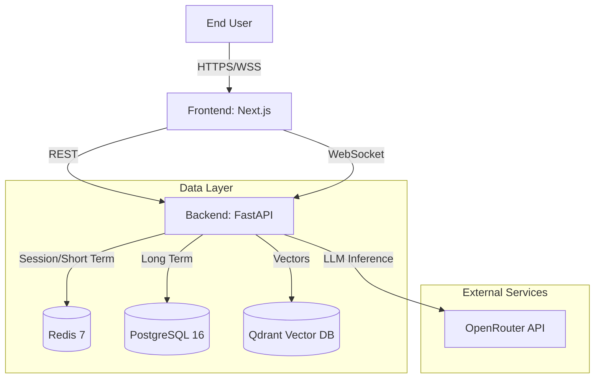
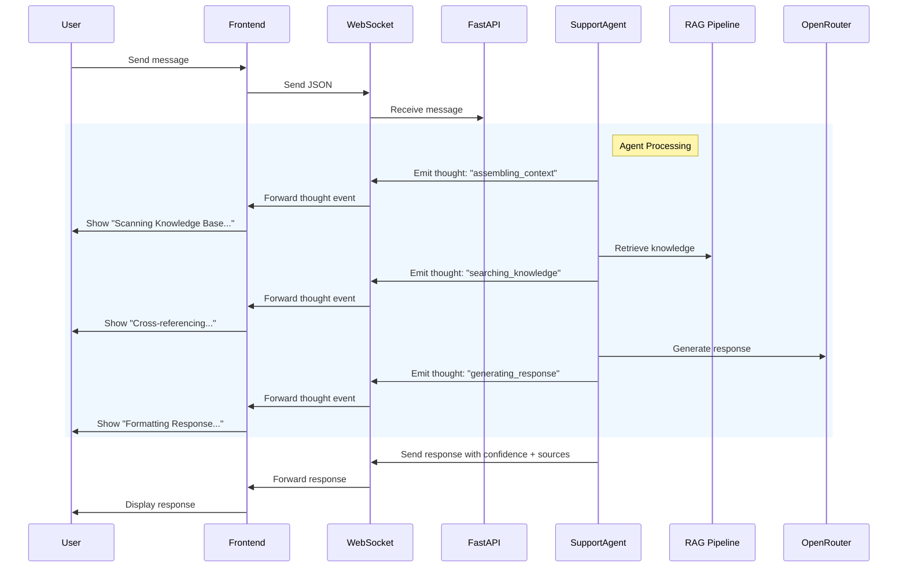
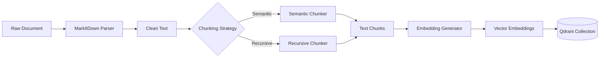
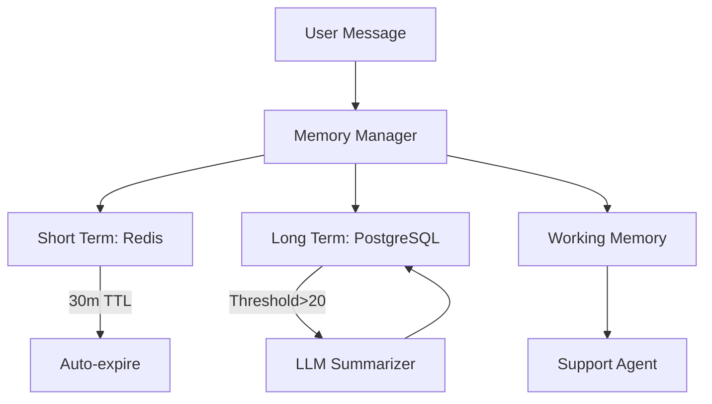

# Project Architecture Document (PAD) - Implementation Plan

**Status:** PLANNING
**Purpose:** Create single-source-of-truth handbook for Singapore SMB Support Agent
**Target Audience:** New developers, AI coding agents, maintainers

---

## 1. Document Structure

The PAD will be organized into the following sections:

### 1.1 Executive Summary
- Project overview and purpose
- Core value propositions
- Key differentiators (Singapore context, PDPA compliance, Avant-Garde design)

### 1.2 System Architecture Overview
- High-level architecture diagram
- Tech stack summary
- Design principles and constraints

### 1.3 Project File Hierarchy
- Complete ASCII tree structure
- Key files with detailed descriptions
- Module responsibility assignments
- File usage patterns

### 1.4 Interaction Diagrams
- Mermaid: System High-Level Architecture
- Mermaid: User → Application Flow
- Mermaid: Chat Flow (WebSocket + REST)
- Mermaid: RAG Ingestion Pipeline
- Mermaid: Memory Management Flow
- Mermaid: Agent Processing Flow

### 1.5 Module Deep-Dives

#### Backend Modules
1. **FastAPI Application Layer** (`app/main.py`, `app/api/`)
   - Request handling, middleware, routing
   - WebSocket connection management
   - Exception handling

2. **Agent Layer** (`app/agent/`)
   - SupportAgent orchestration
   - Tool execution (RAG, business hours, escalation)
   - Thought event emission (WebSocket)

3. **Memory Layer** (`app/memory/`)
   - Short-term (Redis, 30m TTL)
   - Long-term (PostgreSQL)
   - Conversation summarization

4. **RAG Layer** (`app/rag/`)
   - Hybrid retriever (dense + sparse)
   - Query transformation
   - BGE reranking
   - Context compression

5. **Ingestion Pipeline** (`app/ingestion/`)
   - Document parsing (MarkItDown)
   - Chunking (semantic/recursive)
   - Embedding generation
   - Qdrant upsert

6. **Data Models** (`app/models/`)
   - SQLAlchemy ORM models
   - Pydantic schemas (API)

7. **Configuration** (`app/config.py`)
   - Environment variable management
   - Business hours, PDPA settings

#### Frontend Modules
1. **App Shell** (`src/app/`)
   - Next.js App Router
   - Global styles (Avant-Garde theme)

2. **State Management** (`src/stores/chatStore.ts`)
   - Zustand store
   - WebSocket integration
   - Message handling

3. **UI Components** (`src/components/`)
   - Chat interface (ChatWidget, ChatMessages, ChatInput)
   - Trust indicators (ConfidenceRing, SessionPulse, ThinkingState)
   - Evidence viewer (EvidenceSheet, CitationBadge)
   - Shadcn primitives

4. **Services** (`src/lib/`)
   - REST API client
   - WebSocket client
   - Utility functions

5. **Type Definitions** (`src/types/index.ts`)
   - TypeScript interfaces
   - WebSocket message types

### 1.6 Data Flow

#### Chat Request Flow
1. User sends message via WebSocket
2. WebSocket emits to backend
3. Agent processes message with thought events
4. RAG retrieves knowledge
5. Response generated with confidence + sources
6. WebSocket streams response + thought events to frontend

#### Ingestion Flow
1. Document uploaded → MarkItDown parser
2. Text chunked (semantic/recursive)
3. Embeddings generated (OpenAI/Mock)
4. Qdrant upsert with metadata
5. Searchable in RAG pipeline

### 1.7 Configuration
- Environment variables
- Docker orchestration
- Database schemas
- Vector DB settings

### 1.8 Deployment
- Local development setup
- Docker Compose
- Production considerations
- PDPA compliance checklist

### 1.9 Development Guidelines
- Backend patterns (async/await, DI)
- Frontend patterns (Zustand, React hooks)
- Testing approach
- Code style conventions

### 1.10 Critical Implementation Details
- WebSocket thought event protocol
- RAG retriever vector API usage
- Memory manager TTL handling
- Session expiry management
- PDPA data retention

---

## 2. Key Files Annotated

### Backend Critical Files
| File | Purpose | Key Classes/Functions |
|------|---------|---------------------|
| `app/main.py` | FastAPI entry point | lifespan, middleware, routes |
| `app/agent/support_agent.py` | AI orchestration | SupportAgent, _emit_thought() |
| `app/api/routes/chat.py` | Chat + WebSocket endpoints | websocket_chat(), manager |
| `app/rag/retriever.py` | Hybrid search | HybridRetriever, hybrid_search() |
| `app/rag/pipeline.py` | RAG orchestration | RAGPipeline, run() |
| `app/memory/manager.py` | Memory coordination | MemoryManager, get_working_memory() |
| `app/ingestion/pipeline.py` | Document ingestion | IngestionPipeline, ingest_document() |
| `app/config.py` | Configuration | Settings class |
| `app/dependencies.py` | Dependency injection | get_db(), get_memory_manager() |

### Frontend Critical Files
| File | Purpose | Key Functions |
|------|---------|--------------|
| `src/stores/chatStore.ts` | State management | connectWebSocket(), handleWSMessage(), sendMessage() |
| `src/lib/websocket.ts` | WebSocket client | WebSocketClient class |
| `src/lib/api.ts` | REST client | authService, chatService |
| `src/components/chat/ChatWidget.tsx` | Main chat UI | ChatWidget component |
| `src/types/index.ts` | Type definitions | WSMessage, WSThought, Session |
| `tailwind.config.ts` | Styling config | 2px radius, trust colors |

---

## 3. Mermaid Diagrams Plan

### 3.1 System High-Level Architecture

### 3.2 Chat Flow with WebSocket Thoughts

### 3.3 RAG Ingestion Pipeline

### 3.4 Memory Management

---

## 4. Validation Checklist

Before finalizing PAD, verify:

### Codebase Accuracy
- [ ] All files listed actually exist
- [ ] File paths are correct
- [ ] Import statements match actual code
- [ ] Component names match actual code

### WebSocket Integration (Recent Fix)
- [ ] WebSocket thought event protocol documented
- [ ] ConnectionManager described correctly
- [ ] Frontend WebSocket client usage detailed
- [ ] Fallback to REST documented

### RAG Pipeline (Recent Fix)
- [ ] Qdrant native API usage documented
- [ ] Hybrid retriever explained (dense only after fix)
- [ ] Embedding strategy described

### Frontend Architecture
- [ ] Zustand store structure accurate
- [ ] Component hierarchy correct
- [ ] TypeScript types match actual definitions
- [ ] Tailwind config documented (2px radius)

### Backend Architecture
- [ ] FastAPI routes documented
- [ ] Dependency injection pattern explained
- [ ] Async/await patterns described
- [ ] Memory manager hierarchy accurate

### Diagrams
- [ ] All interactions are accurate
- [ ] Component relationships are correct
- [ ] Data flow directions are accurate

---

## 5. Implementation Timeline

| Phase | Tasks | Estimated Effort |
|-------|--------|----------------|
| 1. Structure & Overview | Write executive summary, tech stack, design principles | 30 min |
| 2. File Hierarchy | Generate ASCII tree, annotate key files | 45 min |
| 3. Mermaid Diagrams | Create 5-6 interaction diagrams | 45 min |
| 4. Module Deep-Dives | Write detailed component descriptions | 60 min |
| 5. Data Flow | Document request/response flows | 30 min |
| 6. Configuration & Deployment | Environment setup, Docker, deployment guide | 30 min |
| 7. Development Guidelines | Coding patterns, testing, conventions | 30 min |
| **Total** | | **~4.5 hours** |

---

## 6. Success Criteria

The PAD is complete when:

1. ✅ All 10 major sections are populated
2. ✅ ASCII file hierarchy shows entire codebase
3. ✅ At least 5 Mermaid diagrams included
4. ✅ All critical files are annotated
5. ✅ WebSocket thought streaming is fully documented
6. ✅ RAG retriever fix (native Qdrant API) is reflected
7. ✅ Frontend state management (Zustand) is explained
8. ✅ Avant-Garde design decisions are documented
9. ✅ Development guidelines enable onboarding
10. ✅ PDPA compliance section is included

---

## 7. Approval Required

Before executing this plan, confirm:

- [ ] Document structure meets requirements
- [ ] Validation checklist is comprehensive
- [ ] Timeline is reasonable
- [ ] Success criteria are measurable

**Next Step:** Upon approval, execute implementation phases sequentially.
