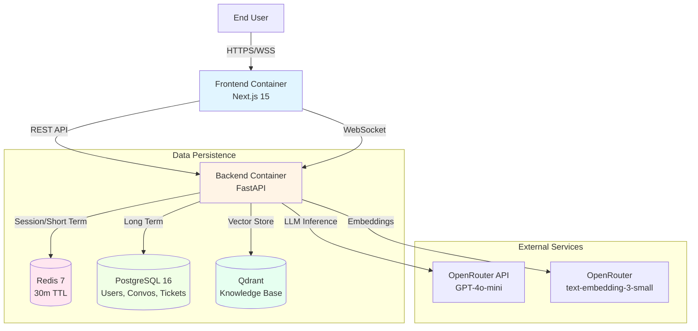
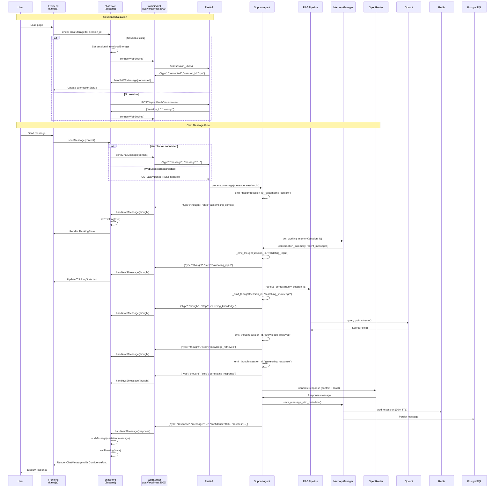
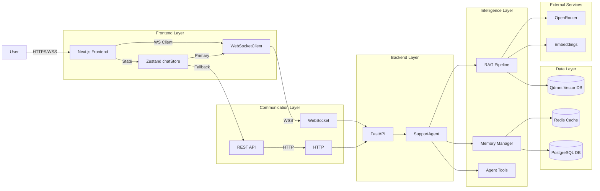

# Project Architecture Document (PAD)

**Project:** Singapore SMB Customer Support AI Agent
**Version:** 1.0 (Current Implementation State)
**Date:** January 1, 2026
**Status:** MVP / Phase 9 Complete

---

## 1. Executive Summary

The **Singapore SMB Support Agent** is a specialized AI customer service system designed for the Singapore market. It differentiates itself through:

- **Context Awareness:** Built-in logic for Singapore business hours (GMT+8) and public holidays
- **PDPA Compliance:** Strict adherence to Personal Data Protection Act guidelines via data minimization, 30-minute session TTL, and auto-expiry
- **Avant-Garde Aesthetics:** "No-AI-Slop" frontend design with sharp edges (2px radius), high-contrast typography (Manrope/Inter), and trust-centric visual hierarchy
- **Hybrid Intelligence:** Sophisticated RAG pipeline combining dense vector search (Qdrant) with real-time WebSocket thought streaming for AI transparency

This document serves as the **single source of truth** for developers, providing a comprehensive understanding of the actual codebase as of Phase 9 completion.

---

## 2. System Architecture Overview

### 2.1 High-Level Architecture



### 2.2 Tech Stack

| Layer | Technology | Key Libraries/Components |
|:------|:-----------|:----------------------|
| **Frontend** | React 18, Next.js 15 | Zustand, Tailwind CSS 3.4, Shadcn UI, Lucide React |
| **Backend** | Python 3.12, FastAPI | Pydantic AI, LangChain, SQLAlchemy (Async), Alembic |
| **Database** | PostgreSQL 16 | `asyncpg` driver, Alembic migrations |
| **Vector DB** | Qdrant | Native client API (`query_points`) |
| **Cache** | Redis 7 | `redis-py` (async) with 30-minute TTL |
| **LLM** | OpenRouter | GPT-4o-mini (Primary), GPT-4o (Fallback) |
| **Embeddings** | OpenRouter | text-embedding-3-small (1536 dimensions) |

### 2.3 Design Principles

1. **Avant-Garde Utilitarian:** 2px border radius (no soft edges), Zinc-950/Zinc-100 high-contrast theme
2. **Trust-Centric UX:** ConfidenceRing, SessionPulse, ThinkingState visualization for AI transparency
3. **PDPA-First:** Automatic data expiration, consent tracking, minimal data collection
4. **Modular Architecture:** Separation of concerns (Agent, Memory, RAG, Ingestion)
5. **WebSocket-First:** Real-time thought streaming with REST fallback

---

## 3. Project File Hierarchy

### 3.1 Backend Structure

```text
backend/
├── app/
│   ├── agent/                      # AI "Brain" Layer
│   │   ├── __init__.py
│   │   ├── prompts/
│   │   │   ├── __init__.py
│   │   │   ├── system.py         # System prompt templates
│   │   │   └── templates.py      # Prompt engineering utilities
│   │   ├── support_agent.py       # MAIN: SupportAgent orchestration
│   │   ├── validators.py         # ResponseValidator (sentiment/PDPA)
│   │   └── tools/              # Agent capabilities
│   │       ├── __init__.py
│   │       ├── retrieve_knowledge.py    # RAG knowledge retrieval
│   │       ├── check_business_hours.py   # Singapore hours logic
│   │       ├── get_customer_info.py      # Customer lookup
│   │       └── escalate_to_human.py     # Human handoff
│   │
│   ├── api/                        # REST API Layer
│   │   ├── __init__.py
│   │   └── routes/
│   │       ├── __init__.py
│   │       ├── chat.py            # Chat + WebSocket endpoints
│   │       └── auth.py            # Authentication endpoints
│   │
│   ├── memory/                     # State Management Layer
│   │   ├── __init__.py
│   │   ├── manager.py            # MAIN: MemoryManager (orchestrator)
│   │   ├── short_term.py         # Redis session store (30m TTL)
│   │   ├── long_term.py          # PostgreSQL persistence
│   │   └── summarizer.py        # LLM conversation compression
│   │
│   ├── rag/                        # Retrieval Layer
│   │   ├── __init__.py
│   │   ├── pipeline.py           # MAIN: RAGPipeline orchestrator
│   │   ├── retriever.py          # MAIN: HybridRetriever (dense search)
│   │   ├── qdrant_client.py      # Qdrant client manager
│   │   ├── query_transform.py    # LLM query rewriting
│   │   ├── reranker.py          # BGE cross-encoder reranking
│   │   └── context_compress.py  # Token budget compression
│   │
│   ├── ingestion/                  # Data Pipeline Layer
│   │   ├── __init__.py
│   │   ├── pipeline.py           # MAIN: IngestionPipeline
│   │   ├── parsers/
│   │   │   ├── __init__.py
│   │   │   └── markitdown_parser.py  # MarkItDown document parsing
│   │   ├── chunkers/
│   │   │   ├── __init__.py
│   │   │   └── chunker.py       # Semantic + Recursive chunking
│   │   └── embedders/
│   │       ├── __init__.py
│   │       ├── embedding.py       # OpenAI embeddings via OpenRouter
│   │       └── mock_embedding.py  # Mock embeddings for testing
│   │
│   ├── models/                     # Data Models
│   │   ├── __init__.py
│   │   ├── database.py           # SQLAlchemy ORM models
│   │   ├── schemas.py            # Pydantic API schemas
│   │   └── domain.py             # Domain entities
│   │
│   ├── alembic/                    # Database Migrations
│   │   ├── env.py
│   │   └── versions/
│   │
│   ├── services/                   # Business Logic Services
│   │   └── __init__.py
│   │
│   ├── config.py                   # MAIN: Settings (environment variables)
│   ├── dependencies.py             # Dependency injection (get_db, get_memory_manager)
│   └── main.py                    # MAIN: FastAPI application entry point
│
├── data/                          # Knowledge Base Documents
│   ├── faq/                       # FAQ documents
│   │   ├── 01_pricing.md
│   │   ├── 02_business_hours.md
│   │   ├── 03_services_overview.md
│   │   ├── 04_returns_refunds.md
│   │   └── 05_shipping_delivery.md
│   ├── policies/                   # Policy documents
│   │   ├── privacy_policy.md
│   │   ├── return_policy.md
│   │   ├── shipping_policy.md
│   │   └── terms_of_service.md
│   └── products/                   # Product catalog
│       └── product_catalog.md
│
├── scripts/
│   └── ingest_documents.py        # CLI tool for RAG ingestion
│
├── tests/                         # Test Suites
│   ├── unit/                      # Unit tests
│   ├── integration/                # Integration tests
│   ├── evaluation/                # RAGAS evaluation
│   ├── conftest.py               # Pytest fixtures
│   └── __init__.py
│
├── .env                          # Environment variables
├── pyproject.toml                # Poetry dependencies
├── pytest.ini                    # Pytest configuration
├── Dockerfile                     # Backend container image
└── docker-compose.yml             # Multi-container orchestration
```

### 3.2 Frontend Structure

```text
frontend/
├── src/
│   ├── app/                        # Next.js App Router
│   │   ├── layout.tsx          # Root layout with Inter font
│   │   ├── page.tsx            # Home page (renders ChatWidget)
│   │   └── globals.css         # Tailwind + CSS variables (trust colors)
│   │
│   ├── components/
│   │   ├── chat/               # Business Logic Components
│   │   │   ├── ChatWidget.tsx       # MAIN: Chat container
│   │   │   ├── ChatMessages.tsx      # Message list rendering
│   │   │   ├── ChatMessage.tsx       # Individual message + ConfidenceRing
│   │   │   ├── ChatInput.tsx         # User input + send button
│   │   │   ├── ChatHeader.tsx        # Session info + SessionPulse
│   │   │   ├── ThinkingState.tsx     # "Scanning..." visualizer
│   │   │   ├── SessionPulse.tsx      # PDPA expiry countdown
│   │   │   ├── EvidenceSheet.tsx     # RAG source viewer (Sheet)
│   │   │   ├── CitationBadge.tsx     # Clickable source citations
│   │   │   └── TypingIndicator.tsx   # Typing animation
│   │   │
│   │   └── ui/                 # Shadcn Primitives (Radix)
│   │       ├── button.tsx
│   │       ├── card.tsx
│   │       ├── badge.tsx
│   │       ├── separator.tsx
│   │       ├── sheet.tsx              # Evidence sheet (radix-dialog)
│   │       ├── scroll-area.tsx       # Custom scrollbar
│   │       ├── label.tsx
│   │       ├── textarea.tsx
│   │       └── confidence-ring.tsx    # Trust indicator (ring animation)
│   │
│   ├── stores/
│   │   └── chatStore.ts        # MAIN: Zustand global state
│   │                                # WebSocket client integration
│   │                                # Message management
│   │                                # Session management
│   │
│   ├── lib/
│   │   ├── api.ts              # MAIN: REST API client
│   │   ├── websocket.ts         # MAIN: WebSocketClient class
│   │   └── utils.ts            # Utility functions (cn, etc)
│   │
│   └── types/
│       └── index.ts            # MAIN: TypeScript definitions
│                               # WSMessage, WSThought, Session, etc.
│
├── public/                        # Static assets
│
├── components.json               # Shadcn UI configuration
├── tailwind.config.ts          # Tailwind theme config (2px radius)
├── tsconfig.json              # TypeScript configuration
├── next.config.js             # Next.js configuration
├── postcss.config.js          # PostCSS configuration
├── package.json               # NPM dependencies
├── package-lock.json          # Dependency lock file
└── Dockerfile                 # Frontend container image
```

---

## 4. Interaction Diagrams

### 4.1 User → Application Chat Flow (WebSocket + REST)



### 4.2 RAG Ingestion Pipeline

```mermaid
graph LR
    Doc[Raw Document<br/>(PDF/DOCX/MD)] --> Parser[MarkItDown Parser<br/>app/ingestion/parsers/markitdown_parser.py]

    Parser --> Text[Clean Text Content]

    Text --> Chunker{Chunking Strategy<br/>app/ingestion/chunkers/chunker.py}

    Chunker -->|Semantic| SemChunker[Sentence Transformers<br/>all-MiniLM-L6-v2]
    Chunker -->|Recursive| RecChunker[Character-based<br/>512 tokens + 50 overlap]

    SemChunker --> Chunks[Text Chunks<br/>~300-500 chars]
    RecChunker --> Chunks

    Chunks --> Embedder[Embedding Generator<br/>app/ingestion/embedders/embedding.py]

    Embedder --> Vectors[Vector Embeddings<br/>1536 dimensions<br/>text-embedding-3-small]

    Vectors --> Points[Qdrant Points<br/>PointStruct<br/>+ Metadata]

    Points --> Qdrant[(Qdrant Collection<br/>knowledge_base)]

    Qdrant --> Searchable[Searchable via<br/>HybridRetriever]
```

### 4.3 Memory Management Flow

```mermaid
graph TD
    UserMsg[User Message] --> MemMgr[MemoryManager<br/>app/memory/manager.py]

    MemMgr -->|Add to session| ST[ShortTermMemory<br/>Redis<br/>30m TTL]
    MemMgr -->|Persist permanently| LT[LongTermMemory<br/>PostgreSQL]

    ST -->|30 minutes| Expire[Auto-expire<br/>PDPA Compliance]

    MemMgr -->|Message count >= 20| Summarizer[ConversationSummarizer<br/>LLM Compression]

    Summarizer -->|Compress history| LT

    MemMgr -->|Assemble context| Working[Working Memory]
    Working -->{Summary +<br/>Recent 5 messages}
    Working --> Agent[SupportAgent]

    ST -.->|Current session data| MemMgr
    LT -.->|Conversation history| MemMgr
```

### 4.4 Agent Processing Flow

```mermaid
graph TD
    Query[User Query] --> Agent[SupportAgent<br/>app/agent/support_agent.py]

    Agent -->|Emit WS thought| WS1[thought: assembling_context]

    Agent --> Validate[ResponseValidator<br/>Sentiment + PDPA]

    Validate -->|Negative sentiment| Escalate[escalate_to_human tool]
    Validate -->|Normal| Retrieve[retrieve_knowledge tool]

    Agent -->|Emit WS thought| WS2[thought: searching_knowledge]

    Retrieve --> RAG[RAGPipeline]

    RAG --> Transform[QueryTransformer<br/>Rewrite query]
    Transform --> Hybrid[HybridRetriever<br/>Qdrant native API]
    Hybrid -->|vector search| Qdrant[(Qdrant)]
    Qdrant --> Docs[ScoredPoint[]]
    Docs --> Rerank[BGEReranker<br/>Cross-encoder]
    Rerank --> Compress[ContextCompressor<br/>Token budget]
    Compress --> Context[Compressed context]

    Agent -->|Emit WS thought| WS3[thought: knowledge_retrieved]

    Context --> LLM[OpenRouter<br/>GPT-4o-mini]

    Agent -->|Emit WS thought| WS4[thought: generating_response]

    LLM --> Response[Response +<br/>Confidence + Sources]

    Agent -->|Emit WS response| WSFinal[WSResponse<br/>type: response]

    Response --> Mem[MemoryManager<br/>Save both memories]

    WSFinal --> Frontend[Frontend<br/>chatStore]
```

### 4.5 System High-Level Data Flow



---

## 5. Module Deep-Dives

### 5.1 Backend Modules

#### 5.1.1 FastAPI Application Layer

**Location:** `backend/app/main.py`

**Key Components:**
- **Lifespan Manager:** Handles database initialization/shutdown
- **Middleware Stack:**
  - CORS (allow all origins for MVP)
  - Request ID injection
  - Logging middleware (adds X-Process-Time header)
- **Exception Handlers:**
  - `StarletteHTTPException`: Returns JSON with error code
  - `RequestValidationError`: Returns 422 with validation error details
  - General exceptions: Returns 500 with internal error

**Routes:**
- `GET /`: Root endpoint with version info
- `GET /health`: Health check with service status
- `include_router(auth.router, prefix="/api/v1")`
- `include_router(chat.router, prefix="/api/v1")`

---

#### 5.1.2 Agent Layer

**Location:** `backend/app/agent/support_agent.py`

**Key Class:** `SupportAgent`

**Dependencies:**
- `rag_pipeline`: RAGPipeline instance
- `memory_manager`: MemoryManager instance
- `db`: SQLAlchemy async session
- `ws_manager`: ConnectionManager for WebSocket thought events

**Key Methods:**

1. **`process_message(message, session_id, user_id)`** - Main orchestration
   - Emits thought: `"assembling_context"`
   - Validates input with ResponseValidator
   - Calls `retrieve_knowledge` tool if RAG available
   - Emits thought: `"searching_knowledge"`, `"knowledge_retrieved"`
   - Emits thought: `"generating_response"`
   - Generates response using system prompt
   - Saves to both short-term and long-term memory
   - Returns `AgentResponse` with confidence + sources

2. **`_emit_thought(session_id, step, details)`** - WebSocket event emission
   - Sends to frontend via ConnectionManager
   - Triggers ThinkingState visualization

3. **`_assemble_context(session_id, user_id)`** - Context assembly
   - Retrieves working memory from MemoryManager
   - Gets business hours status from BusinessContext
   - Returns AgentContext

**Tools:**
- `retrieve_knowledge`: RAG knowledge retrieval
- `check_business_hours`: Singapore hours logic
- `escalate_to_human`: Human handoff + ticket creation

---

#### 5.1.3 Memory Layer

**Location:** `backend/app/memory/manager.py`

**Key Class:** `MemoryManager`

**Architecture:**
- **Short-term:** Redis with 30-minute TTL (PDPA compliance)
- **Long-term:** PostgreSQL for permanent storage
- **Summarizer:** LLM-based compression at 20-message threshold

**Key Methods:**

1. **`get_session(session_id)`** - Get session from Redis
2. **`save_session(session_id, session_data)`** - Save to Redis
3. **`get_working_memory(session_id, max_tokens)`** - Assemble LLM context
   - Returns: conversation_summary + recent 5 messages
4. **`trigger_summarization(session_id, user_id)`** - LLM compression
   - Activates at 20 messages
5. **`save_message_with_metadata(...)`** - Dual save
   - Saves to Redis (short-term)
   - Saves to PostgreSQL (long-term)

**PDPA Compliance:**
- Redis TTL: 30 minutes (auto-expiry)
- PostgreSQL retention: User-defined (default 30 days)
- Consent tracking in User model

---

#### 5.1.4 RAG Layer

**Location:** `backend/app/rag/`

**Key Components:**

**1. RAGPipeline** (`rag/pipeline.py`)
   - Orchestrates: Query Transform → Retrieve → Rerank → Compress
   - Method: `run(query, session_id, conversation_history)`
   - Returns: context + sources + confidence

**2. HybridRetriever** (`rag/retriever.py`) **[RECENT FIX]**
   - **IMPORTANT:** Now uses native Qdrant API (not LangChain wrapper)
   - Method: `hybrid_search(query, collection_name)`
   - Generates vector via EmbeddingGenerator
   - Calls `QdrantManager.query_points()` with vector
   - Returns: `List[ScoredPoint]`
   - **Fix Resolved:** Type mismatch issue (was passing List[float] to string method)

**3. QueryTransformer** (`rag/query_transform.py`)
   - Rewrites query for better retrieval
   - Classifies intent (pricing, hours, services, etc.)
   - Detects language (en, zh, ms, ta)

**4. BGEReranker** (`rag/reranker.py`)
   - Model: `BAAI/bge-reranker-v2-m3`
   - Uses cross-encoder for relevance scoring
   - Returns: Top-N reranked documents

**5. ContextCompressor** (`rag/context_compress.py`)
   - Enforces token budget (4000 tokens)
   - Truncates to fit context window

---

#### 5.1.5 Ingestion Pipeline

**Location:** `backend/app/ingestion/pipeline.py`

**Key Class:** `IngestionPipeline`

**Process Flow:**
1. **Parse:** MarkItDown extracts text from PDF/DOCX/MD
2. **Chunk:**
   - Semantic: Sentence Transformers (all-MiniLM-L6-v2)
   - Recursive: 512 tokens + 50 overlap
3. **Embed:** text-embedding-3-small via OpenRouter
4. **Upsert:** Qdrant PointStruct with metadata

**Methods:**
- `ingest_document(file_path)` - Single document
- `ingest_batch(file_paths, batch_size)` - Multiple documents
- `ingest_directory(directory_path, recursive)` - Directory scan

**Metadata Attached:**
- `file_name`, `file_extension`, `file_size`
- `chunk_index`, `language`, `created_at`

---

#### 5.1.6 Data Models

**Location:** `backend/app/models/`

**SQLAlchemy Models** (`database.py`):
- **User:** PDPA compliance (consent_given_at, data_retention_days)
- **Conversation:** Session metadata (session_id, language, summary_count)
- **Message:** Individual messages (role, content, confidence, sources)
- **ConversationSummary:** LLM-generated summaries
- **SupportTicket:** Escalation records

**Pydantic Schemas** (`schemas.py`):
- **UserRegisterRequest**, **UserLoginRequest**
- **ChatRequest**, **ChatResponse**
- **SourceCitation**
- **HealthCheckResponse**

---

#### 5.1.7 Configuration

**Location:** `backend/app/config.py`

**Key Settings:**
- **Database:** `DATABASE_URL`, `REDIS_URL`
- **Qdrant:** `QDRANT_URL` (http://localhost:6333)
- **OpenRouter:** `OPENROUTER_API_KEY`, `OPENROUTER_BASE_URL`
- **Embeddings:** `EMBEDDING_MODEL` (text-embedding-3-small), `EMBEDDING_DIMENSION` (1536)
- **Business:** `BUSINESS_HOURS_START` (09:00), `BUSINESS_HOURS_END` (18:00)
- **PDPA:** `PDPA_SESSION_TTL_MINUTES` (30), `PDPA_DATA_RETENTION_DAYS` (30)
- **RAG:** `RETRIEVAL_TOP_K` (50), `RERANK_TOP_N` (5), `CONTEXT_TOKEN_BUDGET` (4000)

---

### 5.2 Frontend Modules

#### 5.2.1 App Shell

**Location:** `frontend/src/app/`

**layout.tsx:**
- Font: Inter (Google Fonts)
- Global styles from `globals.css`

**page.tsx:**
- Renders `ChatWidget` component

**globals.css:**
- Tailwind directives
- CSS Variables: `--semantic-green`, `--semantic-amber`, `--semantic-red`
- Trust colors for ConfidenceRing, SessionPulse

---

#### 5.2.2 State Management

**Location:** `frontend/src/stores/chatStore.ts`

**Technology:** Zustand with devtools middleware

**State Structure:**
```typescript
interface ChatStore {
  // Session
  sessionId: string | null;
  isConnected: boolean;
  connectionStatus: 'connecting' | 'connected' | 'disconnected' | 'error';

  // Messages
  messages: Message[];
  isTyping: boolean;

  // Trust & Thinking
  isThinking: boolean;
  expandedCitation: number | null;

  // WebSocket client
  socketClient: WebSocketClient | null;
}
```

**Key Actions:**

1. **`connectWebSocket()`** - Initialize WebSocketClient
   - Creates client with session_id
   - Binds handlers: `onMessage`, `onOpen`, `onError`, `onClose`
   - Auto-connects after session creation

2. **`disconnectWebSocket()`** - Clean disconnect
   - Closes WebSocket
   - Clears client reference

3. **`handleWSMessage(message: WSMessage)`** - WebSocket event handler
   - `connected`: Update connection status
   - `thought`: Set `isThinking(true)`, trigger ThinkingState
   - `response`: Add assistant message, set `isThinking(false)`
   - `error`: Add error message

4. **`sendMessage(content)`** - Send message
   - **Primary:** WebSocket (`socketClient.sendChatMessage()`)
   - **Fallback:** REST API (`chatService.sendMessage()`)
   - Adds user message to store
   - Sets `isTyping(true)`

5. **`createSession()`** - Create new session
   - Calls `authService.createSession()`
   - Auto-calls `connectWebSocket()`
   - Saves to localStorage

6. **`disconnect()`** - End session
   - Disconnects WebSocket
   - Calls `authService.logout()`
   - Clears localStorage
   - Resets store state

---

#### 5.2.3 WebSocket Client

**Location:** `frontend/src/lib/websocket.ts`

**Class:** `WebSocketClient`

**Features:**
- Auto-reconnect with exponential backoff (3s interval)
- Heartbeat/ping-pong (30s interval)
- Max reconnect attempts: 10
- Session-based connection (`?session_id=xyz`)

**Key Methods:**

1. **`connect()`** - Establish WebSocket connection
2. **`send(message: WSRequest)`** - Send JSON message
3. **`sendChatMessage(content)`** - Send chat message
4. **`sendPing()`** - Send heartbeat
5. **`disconnect()`** - Graceful disconnect

**Event Handlers:**
- `onOpen`: Update connection status
- `onMessage`: Dispatch to store handler
- `onError`: Trigger reconnect
- `onClose`: Schedule reconnect

---

#### 5.2.4 REST API Client

**Location:** `frontend/src/lib/api.ts`

**Services:**

**authService:**
- `register(request)` - POST `/api/v1/auth/register`
- `login(request)` - POST `/api/v1/auth/login`
- `logout(session_id)` - POST `/api/v1/auth/logout`
- `getCurrentUser(session_id)` - GET `/api/v1/auth/me`
- `createSession()` - POST `/api/v1/auth/session/new`

**chatService:**
- `sendMessage(request)` - POST `/api/v1/chat` (fallback)
- `getSession(session_id)` - GET `/api/v1/chat/sessions/:id`

**healthService:**
- `check()` - GET `/health`

**Error Handling:**
- Custom `APIError` class
- Throws on HTTP errors with status code + error code

---

#### 5.2.5 UI Components

**Chat Components:**

1. **ChatWidget** (`components/chat/ChatWidget.tsx`)
   - Main container
   - Manages session lifecycle
   - Renders: ChatHeader, ChatMessages, ChatInput

2. **ChatMessage** (`components/chat/ChatMessage.tsx`)
   - Renders user/assistant/system messages
   - **ConfidenceRing:** Visual trust indicator
   - **CitationBadge:** Clickable source references

3. **ThinkingState** (`components/chat/ThinkingState.tsx`)
   - "Scanning Knowledge Base..." visualizer
   - Cycles through: Scanning → Cross-referencing → Formatting
   - Animated dots

4. **SessionPulse** (`components/chat/SessionPulse.tsx`)
   - PDPA expiry countdown (Green → Amber → Red)
   - 30-minute TTL visualization

5. **EvidenceSheet** (`components/chat/EvidenceSheet.tsx`)
   - Radix Sheet (slide-out panel)
   - Shows source content + metadata
   - Copy to clipboard functionality

**UI Primitives (Shadcn):**

- **ConfidenceRing** (`ui/confidence-ring.tsx`)
  - Ring animation: Green (≥85%), Amber (≥70%), Red (<70%)
  - Sizes: sm, md, lg

- **ScrollArea** (`ui/scroll-area.tsx`)
  - Custom scrollbar (Radix ScrollArea)

- **Sheet** (`ui/sheet.tsx`)
  - Evidence sheet panel

---

#### 5.2.6 Type Definitions

**Location:** `frontend/src/types/index.ts`

**Key Types:**

```typescript
// Messages
export type MessageRole = 'user' | 'assistant' | 'system';
export interface Message {
  id: string;
  role: MessageRole;
  content: string;
  timestamp: Date;
  confidence?: number;
  sources?: Source[];
}

// WebSocket Messages
export interface WSConnected {
  type: 'connected';
  session_id: string;
  message: string;
}

export interface WSResponse {
  type: 'response';
  session_id: string;
  message: string;
  confidence: number;
  sources: Source[];
  requires_followup: boolean;
  escalated: boolean;
  ticket_id?: string;
}

export interface WSThought {  // [RECENT ADDITION]
  type: 'thought';
  step: string;  // "assembling_context", "searching_knowledge", etc.
  details?: string;
}

export type WSMessage = WSConnected | WSResponse | WSThought | WSError | WSPong;

// Sessions
export interface Session {
  session_id: string;
  user_id?: number;
  created_at: string;
  expires_at?: Date;
}
```

---

## 6. Data Flow

### 6.1 Chat Request Flow (WebSocket-First)

1. **User sends message** → ChatInput → `chatStore.sendMessage()`
2. **WebSocket active?**
   - **Yes:** `socketClient.sendChatMessage(content)`
   - **No:** Fallback to `chatService.sendMessage()` (REST)
3. **Backend receives** → WebSocket handler → `SupportAgent.process_message()`
4. **Thought events stream:**
   - `"assembling_context"` → Frontend shows "Scanning..."
   - `"validating_input"` → Frontend updates ThinkingState
   - `"searching_knowledge"` → Frontend shows "Cross-referencing..."
   - `"knowledge_retrieved"` → Frontend continues
   - `"generating_response"` → Frontend shows "Formatting..."
5. **RAG retrieval** → HybridRetriever → Qdrant → Results
6. **LLM generates** → Response with confidence + sources
7. **Response sent** → WebSocket → Frontend `handleWSMessage(response)`
8. **Frontend renders** → ChatMessage with ConfidenceRing + CitationBadges
9. **Memory saved** → Redis (30m TTL) + PostgreSQL (permanent)

### 6.2 Ingestion Flow

1. **Document uploaded** → `scripts/ingest_documents.py`
2. **MarkItDown parses** → Extract text
3. **Chunk strategy:**
   - **Semantic:** Sentence Transformers (all-MiniLM-L6-v2)
   - **Recursive:** 512 tokens + 50 overlap
4. **Embeddings generated** → OpenRouter (text-embedding-3-small)
5. **Qdrant upsert** → PointStruct with metadata
6. **Searchable** → Available in HybridRetriever

### 6.3 Memory Flow

**Short-term (Redis):**
- Key: `session:{session_id}`
- Value: JSON blob (messages, user_id, created_at)
- TTL: 30 minutes (auto-expiry)
- Purpose: Fast access, PDPA compliance

**Long-term (PostgreSQL):**
- Table: `messages`
- Purpose: Permanent audit trail
- Compression: LLM summarization at 20 messages

---

## 7. Configuration

### 7.1 Environment Variables

**Required:**
```bash
DATABASE_URL=postgresql+asyncpg://...
REDIS_URL=redis://localhost:6379
QDRANT_URL=http://localhost:6333
OPENROUTER_API_KEY=sk-or-...
OPENROUTER_BASE_URL=https://openrouter.ai/api/v1
SECRET_KEY=your-secret-key-min-32-chars
```

**Optional:**
```bash
EMBEDDING_MODEL=text-embedding-3-small
EMBEDDING_DIMENSION=1536
LLM_MODEL_PRIMARY=openai/gpt-4o-mini
LLM_MODEL_FALLBACK=openai/gpt-4o
BUSINESS_HOURS_START=09:00
BUSINESS_HOURS_END=18:00
TIMEZONE=Asia/Singapore
PDPA_SESSION_TTL_MINUTES=30
PDPA_DATA_RETENTION_DAYS=30
```

### 7.2 Docker Orchestration

**Frontend Container:**
- Base: Node.js 20+
- Build: `next build`
- Port: 3000

**Backend Container:**
- Base: Python 3.12
- Install: Poetry dependencies
- Port: 8000

**Services:**
- **PostgreSQL:** Port 5432
- **Redis:** Port 6379
- **Qdrant:** Port 6333

---

## 8. Deployment

### 8.1 Local Development Setup

```bash
# Backend
cd backend
python -m venv venv
source venv/bin/activate
pip install -r requirements.txt  # or use poetry
cp .env.example .env  # Fill in required variables
docker-compose up -d  # Start DB, Redis, Qdrant
python -m uvicorn app.main:app --reload

# Frontend
cd frontend
npm install
npm run dev  # Next.js dev server on http://localhost:3000
```

### 8.2 Production Deployment

**Considerations:**
1. **Environment Variables:** Use secret management (AWS Secrets Manager, etc.)
2. **Database:** Use managed PostgreSQL (RDS, Cloud SQL)
3. **Redis:** Use managed Redis (ElastiCache, Redis Cloud)
4. **Qdrant:** Use managed Qdrant Cloud
5. **HTTPS:** Enable SSL/TLS for WebSocket (WSS)
6. **Rate Limiting:** Implement on API endpoints
7. **Monitoring:** Add logging + metrics (Prometheus, etc.)

---

## 9. Development Guidelines

### 9.1 Backend Patterns

**Async/Await:**
- All I/O operations must be async
- Use `async def` for route handlers
- Use `await` for DB, Redis, HTTP, LLM calls

**Dependency Injection:**
- Use `Depends(get_db)` for database sessions
- Use `Depends(get_memory_manager)` for memory
- Use `Depends(get_business_context)` for business logic

**Error Handling:**
- Always wrap in try/except
- Return appropriate HTTP status codes
- Use `ErrorResponse` model for consistent error responses

### 9.2 Frontend Patterns

**Zustand:**
- Use `useChatStore()` in components
- Call actions: `const { sendMessage } = useChatStore.getState()`
- State is reactive (auto-renders)

**React Hooks:**
- Use `useEffect` for side effects (mount, update, unmount)
- Use `useState` for local component state
- Use `useCallback` for memoized handlers

**TypeScript:**
- Always use type annotations
- Import from `@/types` for shared types
- No `any` types (use `unknown` + type guards)

### 9.3 Code Style

**Python:**
- Follow PEP 8
- Use type hints (from `typing` module)
- Docstrings for all public functions

**TypeScript:**
- Use functional components
- Prefer arrow functions
- Destructure props

---

## 10. Critical Implementation Details

### 10.1 WebSocket Thought Event Protocol [RECENT FIX]

**Backend Emission:** (`app/agent/support_agent.py`)
```python
async def _emit_thought(self, session_id: str, step: str, details: str = ""):
    if self.ws_manager:
        await self.ws_manager.send_message(
            session_id=session_id,
            message={
                "type": "thought",
                "step": step,
                "details": details,
            }
        )
```

**Frontend Handling:** (`src/stores/chatStore.ts`)
```typescript
handleWSMessage(message: WSMessage) {
  switch (message.type) {
    case 'thought':
      setThinking(true);
      console.log('[WebSocket] Thought:', message.step);
      break;
    // ...
  }
}
```

**Thought Steps:**
1. `"assembling_context"` - Gathering session data
2. `"validating_input"` - Checking sentiment/PDPA
3. `"searching_knowledge"` - RAG retrieval
4. `"knowledge_retrieved"` - Sources found
5. `"generating_response"` - LLM generation

### 10.2 RAG Retriever (Native Qdrant API) [RECENT FIX]

**Issue Resolved:** Type mismatch when passing `List[float]` to LangChain's `asimilarity_search_with_score()` (expected string)

**Current Implementation:** (`app/rag/retriever.py`)
```python
async def _dense_search(
    self,
    query_vector: List[float],
    collection_name: str,
    filter: Filter,
) -> List[models.ScoredPoint]:
    """Dense vector search using native Qdrant client."""
    client = QdrantManager.get_client()

    results = client.query_points(
        collection_name=collection_name,
        query=query_vector,  # Direct vector, not string query
        query_filter=filter,
        limit=self.k,
    )

    return results.points
```

**Why This Works:**
- Qdrant's native API accepts vectors directly
- No LangChain wrapper type conversion needed
- Better performance (direct client)

### 10.3 Memory Manager TTL Handling

**Redis Expiry:**
```python
async def save_session(self, session_id: str, session_data: dict) -> None:
    await self.short_term.save_session(session_id, session_data)
    # Automatically expires after 30 minutes
```

**PDPA Compliance:**
- Data auto-deleted after TTL
- No manual cleanup required
- User consent tracked with timestamp

### 10.4 Session Expiry Management

**Frontend SessionPulse:**
```typescript
<SessionPulse
  sessionExpiresAt={new Date(Date.now() + 30 * 60 * 1000)}
  onExtend={handleExtendSession}
/>
```

**Visual States:**
- **Green (>20m):** Session active
- **Amber (5-20m):** Expiring soon
- **Red (<5m):** Critical - extend or lose

### 10.5 Avant-Garde Design Decisions

**Visual Language:**
- **Radius:** `0.125rem` (2px) - Sharp, utilitarian
- **Font:** Manrope (headings), Inter (body) - Professional hierarchy
- **Colors:** Zinc scale (neutral) + Trust colors (Green/Amber/Red)
- **No Soft Shadows:** Flat, minimal decoration

**Trust-Centric UX:**
- **ConfidenceRing:** Pre-attentive trust signaling
- **ThinkingState:** Visible AI process (reduces perceived latency)
- **SessionPulse:** PDPA transparency (countdown visualization)

**Library Discipline:**
- Shadcn/Radix primitives only
- No custom modals/dropdowns
- Tailwind utility classes
- Minimal custom CSS

---

## 11. Known Issues & Remediation Status

| Issue | Status | Resolution |
|-------|--------|------------|
| RAG Retriever Type Mismatch | ✅ FIXED | Uses native Qdrant `query_points()` API |
| Ghost WebSocket Client | ✅ FIXED | Integrated in chatStore with auto-connect |
| Mock Embeddings Active | ⚠️ WARNING | Ensure `OPENROUTER_API_KEY` is set before ingestion |
| Database Connection String Typo | ✅ FIXED | `REDIS_URL` correctly referenced |

---

## 12. Quick Reference

### Backend Key Files Summary

| File | Purpose | Key Exports/Classes |
|------|---------|-------------------|
| `app/main.py` | FastAPI entry point | `app`, middleware, exception handlers |
| `app/agent/support_agent.py` | AI orchestration | `SupportAgent`, `get_support_agent()` |
| `app/api/routes/chat.py` | Chat + WebSocket endpoints | `chat.router`, `ConnectionManager` |
| `app/memory/manager.py` | Memory coordination | `MemoryManager`, `get_memory_manager()` |
| `app/rag/retriever.py` | Hybrid search | `HybridRetriever`, `hybrid_search()` |
| `app/rag/pipeline.py` | RAG orchestration | `RAGPipeline`, `rag_pipeline` |
| `app/ingestion/pipeline.py` | Document ingestion | `IngestionPipeline`, `get_ingestion_pipeline()` |
| `app/config.py` | Configuration | `settings` (pydantic settings) |
| `app/dependencies.py` | Dependency injection | `get_db()`, `get_memory_manager()` |

### Frontend Key Files Summary

| File | Purpose | Key Exports |
|------|---------|-------------|
| `src/stores/chatStore.ts` | Global state | `useChatStore`, connect/disconnect actions |
| `src/lib/websocket.ts` | WebSocket client | `WebSocketClient` class |
| `src/lib/api.ts` | REST client | `authService`, `chatService`, `healthService` |
| `src/types/index.ts` | Type definitions | `Message`, `WSMessage`, `Session` |
| `src/components/chat/ChatWidget.tsx` | Main chat UI | `ChatWidget` component |
| `src/app/globals.css` | Global styles | CSS variables (trust colors, radius) |
| `tailwind.config.ts` | Tailwind config | 2px radius, color palette |

---

## Appendix A: Testing

### Backend Testing

```bash
# Unit tests
pytest tests/unit/ -v

# Integration tests
pytest tests/integration/ -v

# RAG evaluation (requires ingested data)
pytest tests/evaluation/ -v
```

### Frontend Testing

```bash
# Type check
npm run type-check

# Lint
npm run lint

# Build
npm run build

# Run dev server
npm run dev
```

---

**END OF DOCUMENT**

*This document represents the single source of truth for the Singapore SMB Support Agent architecture as of January 1, 2026. All PRs should align with the patterns and decisions documented herein.*
